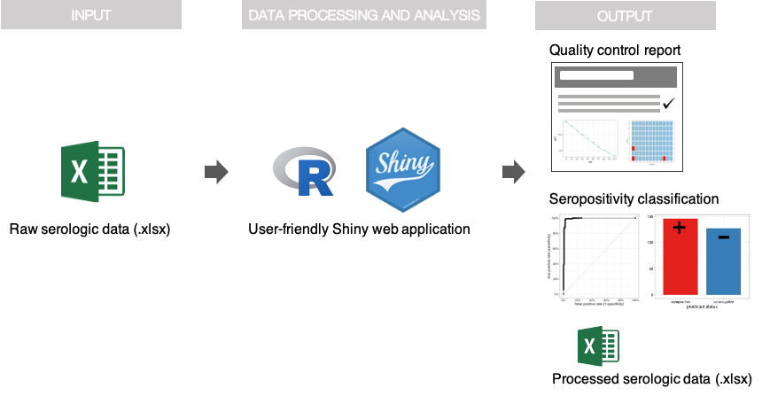

### **covidClassifyR**: a fit-for-purpose tool to support COVID-19 sero-surveillance via serological data processing and statistical analysis

This analytical tool was developed to streamline the processing of serological data generated using a validated high-throughput multiplex serological assay for measuring antibodies to SARS-CoV-2 ([Mazhari et al 2021]([**https://doi.org/10.3390/mps4040072**](https://doi.org/10.3390/mps4040072)). This tool also aims to make the quality control and interpretation of the raw data generated from this serological assay accessible to all researchers without the need for a specialist background in statistical methods and advanced programming. In addition, the data processing and quality control parts of this tool can also be used to process serological data generated using other Luminex-based assays for other organisms, e.g. *Plasmodium* spp.

------------------------------------------------------------------------

### Application overview

{width="500"}

### Instructions for use
