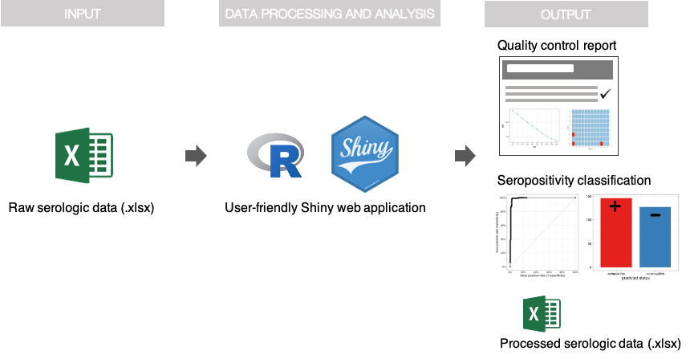

---
output:
  html_document:
    theme: 
      bootswatch: sandstone
---

### **covidClassifyR**: a fit-for-purpose tool to support COVID-19 sero-surveillance via serological data processing and statistical analysis

This analytical tool was developed to streamline the processing of serological data generated using a validated high-throughput multiplex serological assay for measuring antibodies to SARS-CoV-2 ([Mazhari et al 2021](https://doi.org/10.3390/mps4040072)). This tool also aims to make the downstream processing, quality control and interpretation of the raw data generated from this serological assay accessible to all researchers without the need for a specialist background in statistical methods and advanced programming. In addition, the data processing and quality control parts of this tool can also be used to process serological data generated using other Luminex-based assays for other organisms, e.g. *Plasmodium* spp.

#### Graphical overview of the web application:
For details on how to use this app, follow the step-by-step tutorial.

{width="500"}

-----------------------------------------------
#### Acknowledgments

The code and scripts used to develop this R Shiny web application are available on [Github](https://github.com/shaziaruybal/covidclassifyr).

The scripts and functions used in this application were developed by [Shazia Ruybal-Pesántez](https://twitter.com/drshaziaruybal), with contributions from the following researchers:

-   Eamon Conway, WEHI (classification algorithm development)

-   Connie Li Wai Suen, WEHI (original 5-parameter logistic model development for conversion of MFI to RAU)

-   Narimane Nekkab and Michael White, Institut Pasteur (original development of serological classification algorithm for *Plasmodium vivax,* adapted here for *SARS-CoV-2*)

Many thanks to Nick Walker for trialing and providing feedback on early versions of this tool.

We are extremely grateful to have a received funding for this work and in particular to host this web application through a [Regional Collaborations Programme COVID-19 Digital Grant](https://www.science.org.au/news-and-events/news-and-media-releases/regional-research-set-get-digital-boost) from the Australian Academy of Science and the Department of Industry, Science, Energy and Resources.