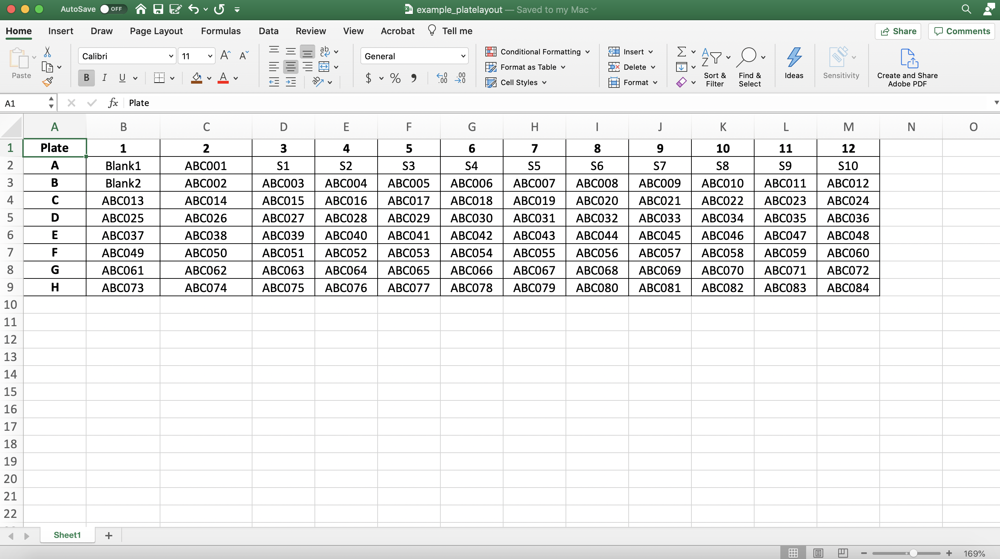
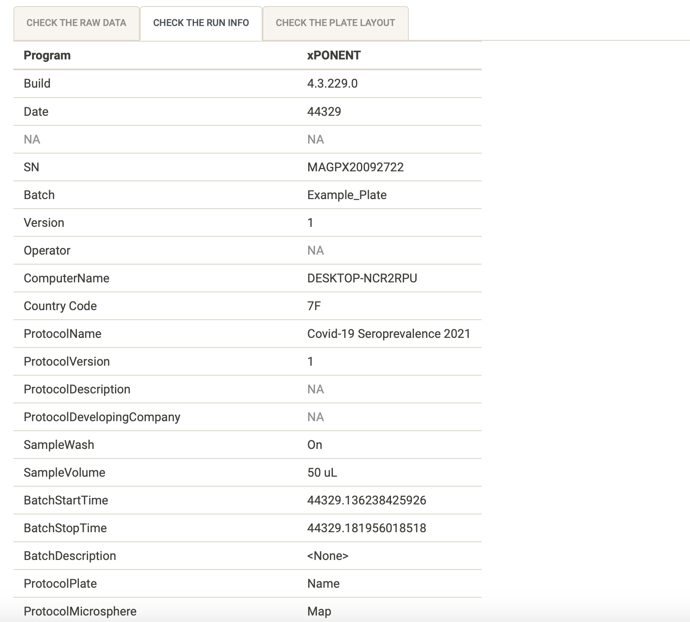

### Before you start: preparing your data input

This web application was designed fit-for-purpose to process raw serology data exported from [Luminex/Magpix machines](https://www.luminexcorp.com/xmap-technology/#instruments). For an example of the raw data output from the machine, download the [example data](https://shaziaruybal.shinyapps.io/covidClassifyR/_w_8c7cb1cd/example_data.zip). The built-in classification algorithms are applicable for those analyzing data from the SARS-CoV-2 multi-antigen Luminex assay as per [Mazhari et al (2021)](https://www.mdpi.com/2409-9279/4/4/72), however, the application can also be used to process serological data from other Luminex assay panels (e.g. for *Plasmodium vivax*) and perform quality control as well as preliminary data visualizations.

#### Raw data requirements
You can pre-program the Luminex protocol so that you can export all the raw data directly from the machine once the plate reading is completed. 

**`r fontawesome::fa("lightbulb")` Tip: ** Make sure you label your antigens the same way in all plate runs. You can do this by setting up the protocol directly on the Luminex machine and using it for all your plate runs. 

If you downloaded the example raw data, it should look like this, otherwise make sure your data looks similar:

Make sure that your sample labels in the Luminex machine protocol are as follows:

* *Standards:* labels start with 'S' and then a number as required (e.g. S1, S2, S3 or Standard1, Standard2, Standard3)
* *Blanks:* labels start with 'B' and then a number as required if there is more than one blank sample (.e.g 'B1', 'B2', or 'Blank 1', 'Blank2' etc). 
* *Unknown samples:* do not include individual sample labels, leave them as 'Unknown'

#### Plate layout requirements
For each 96-well plate that you run on the Luminex machine, prepare a plate layout that includes the sample labels that will match your raw data. The application will match the raw data to the corresponding sample based on the plate layout that you import. 

Make sure that your sample labels in the plate layout are as follows:

* *Standards:* labels start with 'S' and then a number as required (e.g. S1, S2, S3 or Standard1, Standard2, Standard3)
* *Blanks:* labels start with 'B' and then a number as required if there is more than one blank sample (.e.g 'B1', 'B2', or 'Blank 1', 'Blank2' etc). 
* *Unknown samples:* label your unknown samples according to your specific sample codes (e.g. ABC001, ABC002)

Also make sure that there are no extra cells filled out other than the plate wells and sample names. You can use the example plate layout as a template to fill in with your sample details. 

If you downloaded the example plate layout, it should look like this, otherwise make sure your plate layout looks similar:
 

### Navigating the app

* *Import data:* this is where you can upload your raw data and plate layout, you can also label your experiment/project so that all your processed data files and quality control report can have the project name as an identifier. Here you can also make sure that your raw data, run info and plate layout look as expected. See the section [Importing your data](#importing-your-data) for more details.
* *Quality control:* this is where you can perform quality control of your run and your data is run through the processing pipeline to convert median fluorescent units to relative antibody units based on the standard curves you supplied. In this section you can also download the processed data, standard curve data and a quality control report. For moe details, see the section [Quality control](#quality-control).
* *Classification:* this is where you can run the classification algorithm on your data to determine whether unknown samples are seropositive or seronegative (i.e. recently exposed to SARS-CoV-2, or not). We have developed two algorithms that were trained on different datasets. The main difference is that the PNG algorithm included data from the COVID-PROFILE study in Melbourne to train the classifier, and so this algorithm should *not* be used if processing data from the COVID-PROFILE study in Melbourne. Note that if you are running the app for data processing of data that was not generated using the SARS-CoV-2 multi-antigen assay panel from [Mazhari et al (2021)](https://www.mdpi.com/2409-9279/4/4/72), you should skip this section. For more details, see the section [Classifying your samples](#classifying-your-samples).
* *Data visualization:* this is where you can visualize your data interactively within the app. You can take a look at box plots of the antibody data for each antigen in your panel based on raw median fluorescent units, converted relative antibody units and if you ran the classification, you will also be able to visualize the exposure status of your samples based on the classification algorithm. 

### Importing your data

You can import your raw data and plate layout .xlsx files by clicking on the "Browse" button and navigating to the path where your files are located (see below). You can change the experiment name by typing directly in the text box with the experiment name that best describes your particular data/Luminex run. For example, you can label it as "MyExperimentName_Plate01". The analysis date will default to Today's date, but you can modify this by clicking on the date and selecting the date in the calendar. You can also insert experiment notes to provide more details or notes, as necessary. These notes will be displayed on your quality control report when you download it. 

**`r fontawesome::fa("lightbulb")` Tip: ** Try to keep your experiment name/filename free of spaces and instead use "_" or "-". All of your downloadable files (processed data, quality control report, etc) will be labeled as "experiment1_2022-03-06". 

{ width=50% }

When your raw data and plate layouts are uploaded correctly, your screen should look like this, with the blue bars filled in:

{ width=50% }

For today's tutorial, let's change the experiment name to "tutorial_example" and the experiment notes to "This is an example of the QC and processing of the example data for the covidClassifyR tutorial", your screen should now look like this:

{ width=50% }

#### Checking the raw data
You will notice that the "Check the raw data" tab has populated with a preview of your raw data file (see below). You can quickly check here whether it looks as expected. You can also cross-check that the raw data file you uploaded was the correct one, by looking at the "Raw data filename" directly under the tab. If it is the wrong one you can click on "Browse" again and upload the correct file. 

{ width=75% }

#### Checking the run info
You can also use the "Check the run info" tab to only look at run specifications and check that they are expected. For example, you can check that the Batch, ProtocolName and sample volume are correct and labeled as you expect them to be. 

In the case of the example data, the batch should be labeled "Example_Plate", the protocol should be labeled "Covid-19 Seroprevalence 2021" and the sample volume should be "50 uL", as below:

{ width=75% }

#### Checking the plate layout
You can click on the "Check the plate layout" tab to make sure the plate layout looks as expected. It is very important to make sure your samples are labeled correctly so that they are interpreted correctly by the app. You can also cross-check that the plate layout file you uploaded was the correct one, by looking at the "Plate layout filename" directly under the tab. If it is the wrong one you can click on "Browse" again and upload the correct file. 

Make sure that your sample labels in the plate layout are as follows:

* *Standards:* labels start with 'S' and then a number as required (e.g. S1, S2, S3 or Standard1, Standard2, Standard3)
* *Blanks:* labels start with 'B' and then a number as required if there is more than one blank sample (.e.g 'B1', 'B2', or 'Blank 1', 'Blank2' etc). 
* *Unknown samples:* label your unknown samples according to your specific sample codes (e.g. ABC001, ABC002)

Also make sure that there are no extra cells filled out other than the plate wells and sample names. If you haven't run a full plate, you can leave the wells with no samples completely blank (i.e. no lasbel).

In the case of the example data, the plate layout should appear as below:

{ width=75% }

**`r fontawesome::fa("lightbulb")` Tip: ** You can use the example plate layout as a template, delete the cell contents and fill in with your sample details. Make sure that the word "Plate" is included in the first column, as the app expects this in order to determine the position of each sample and match it to the raw data outputs.  

### Quality control
This section allows you to check the quality of your Luminex run, you can navigate each tab individually and also click the "Download" tab to download your process sample data, the standard curve values and the quality control report. All of the plots in the "Quality Control" section will be included in the QC report. 

#### Standard curves

#### Plate quality control

#### Blank samples

#### Model results

The automated data processing in this app allows you to convert your median fluorescence units (MFI) data into relative antibody units (RAU) by fitting a 5-parameter logistic function to the standard curve on a per-antigen level.

#### Sample results

This table is interactive, and allows you to take a quick look at your processed data. For example you can use the search bar to search for a particular sample name. In the example below we filter for sample ABC036.

You can also re-order specific columns and sort them from highest to lowest, or vice versa by clicking on the triangles next to the column name. In the example below we sorted from lowest to highest MFI value for IVB-Vict_31. 

When you are finished you can download the data and quality control report by clicking on the ['Download'](#downloading-your-processed-data) tab.

### Downloading your processed data

{width=75%}

### Classifying your samples

{width=75%}

### Data visualization 

#### MFI boxplot

#### RAU boxplot

#### Exposure status

### Output from this tutorial

[Click here to download an example of the output from this tutorial](output_tutorial.zip)

### Troubleshooting
