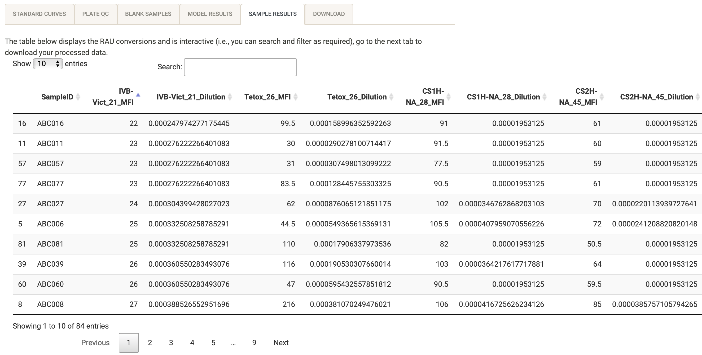
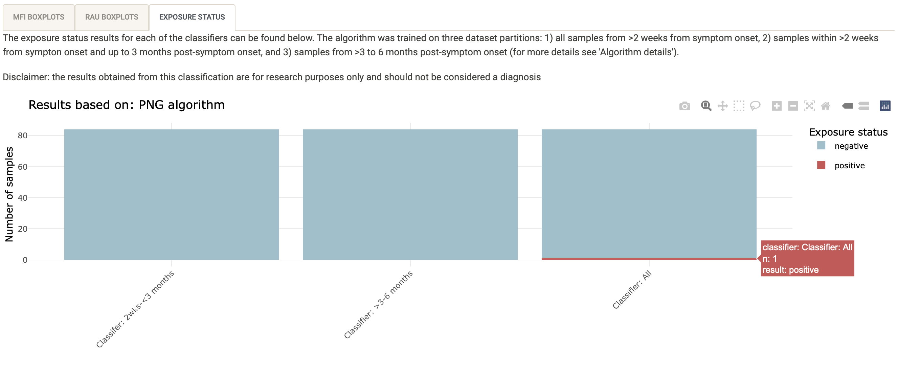

### Before you start: preparing your data input

This web application was designed fit-for-purpose to process raw serology data exported from [Luminex/Magpix machines](https://www.luminexcorp.com/xmap-technology/#instruments). For an example of the raw data output from the machine, [download the example data](https://shaziaruybal.shinyapps.io/covidClassifyR/_w_8c7cb1cd/example_data.zip). The built-in classification algorithms are applicable for those analyzing data from the SARS-CoV-2 multi-antigen Luminex assay as per [Mazhari et al (2021)](https://www.mdpi.com/2409-9279/4/4/72), however, the application can also be used to process serological data from other Luminex assay panels (e.g. for *Plasmodium vivax*) and perform quality control as well as preliminary data visualizations.

#### Raw data requirements

You can pre-program the Luminex protocol so that you can export all the raw data directly from the machine once the plate reading is completed.

**`r fontawesome::fa("lightbulb")` Tip:** Make sure you label your antigens the same way in all plate runs. You can do this by setting up the protocol directly on the Luminex machine and using it for all your plate runs.

If you downloaded the example raw data, it should look like this, otherwise make sure your data looks similar: 

Make sure that your sample labels in the Luminex machine protocol are as follows:

-   *Standards:* labels start with 'S' and then a number as required (e.g. S1, S2, S3 or Standard1, Standard2, Standard3)
-   *Blanks:* labels start with 'B' and then a number as required if there is more than one blank sample (.e.g 'B1', 'B2', or 'Blank 1', 'Blank2' etc).
-   *Unknown samples:* do not include individual sample labels, leave them as 'Unknown'

#### Plate layout requirements

For each 96-well plate that you run on the Luminex machine, prepare a plate layout that includes the sample labels that will match your raw data. The application will match the raw data to the corresponding sample based on the plate layout that you import.

Make sure that your sample labels in the plate layout are as follows:

-   *Standards:* labels start with 'S' and then a number as required (e.g. S1, S2, S3 or Standard1, Standard2, Standard3)
-   *Blanks:* labels start with 'B' and then a number as required if there is more than one blank sample (.e.g 'B1', 'B2', or 'Blank 1', 'Blank2' etc).
-   *Unknown samples:* label your unknown samples according to your specific sample codes (e.g. ABC001, ABC002)

Also make sure that there are no extra cells filled out other than the plate wells and sample names. You can use the example plate layout as a template to fill in with your sample details.

If you downloaded the example plate layout, it should look like this, otherwise make sure your plate layout looks similar:  **`r fontawesome::fa("lightbulb")` Tip:** The application expects standards to start with 'S' and blanks to start with 'B', but everything else with a label will be considered an unknown sample. If you have other types of samples, for example a positive control, you can use a different sample label to the other unknown study samples (i.e. "PositiveControl" in addition to the "ABC" study codes).

### Navigating the app

-   *Import data:* this is where you can upload your raw data and plate layout, you can also label your experiment/project so that all your processed data files and quality control reports can have the project name as an identifier. Here you can also make sure that your raw data, run info and plate layout look as expected. See the section [Importing your data](#importing-your-data) for more details.
-   *Quality control:* this is where you can perform quality control of your run and your data is run through the processing pipeline to convert median fluorescent units to relative antibody units based on the standard curves present on each plate. In this section you can also download the processed data, standard curve data and a quality control report. For more details, see the section [Quality control](#quality-control).
-   *Classification:* this is where you can run the classification algorithm on your data to determine whether unknown samples are seropositive or seronegative (i.e. recently exposed to SARS-CoV-2, or not). We have developed two algorithms that were trained on different datasets. Based on the samples used to train the dataset, if you are processing data from PNG, please use "PNG algorithm" and if you are processing data from the COVID-PROFILE study, please use "Melbourne algorithm". Note that if you are running the app for data processing of samples with a different antigen panel to the one from [Mazhari et al (2021)](https://www.mdpi.com/2409-9279/4/4/72), you should skip this section. For more details, see the section [Classifying your samples](#classifying-your-samples).
-   *Data visualization:* this is where you can visualize your data interactively within the app. You can take a look at box plots of the antibody data for each antigen in your panel based on raw median fluorescent units, converted relative antibody units and if you ran the classification, you will also be able to visualize the exposure status of your samples based on the classification algorithm. For more details, see the section [Data visualization](#data-visualization).

### Importing your data {#importing-your-data}

You can import your raw data and plate layout .xlsx files by clicking on the "Browse" button and navigating to the path where your files are located (see below). You can change the experiment name by typing directly in the text box with the experiment name that best describes your particular data/Luminex run. For example, you can label it as "MyExperimentName_Plate01". The analysis date will default to Today's date, but you can modify this by clicking on the date and selecting the date in the calendar. You can also insert experiment notes to provide more details or notes, as necessary. These notes will be displayed on your quality control report when you download it.

**`r fontawesome::fa("lightbulb")` Tip:** Try to keep your experiment name/filename free of spaces and instead use "\_" or "-". All of your downloadable files (processed data, quality control report, etc) will be labeled as "experiment1_2022-03-06".

{width="50%"}

When your raw data and plate layouts are uploaded correctly, your screen should look like this, with the blue bars filled in:

{width="50%"}

**`r fontawesome::fa("lightbulb")` Tip:** If you get an error when uploading your files, make sure they are .xlsx for both the raw data and plate layout files. 

For today's tutorial, let's change the experiment name to "tutorial_example" and the experiment notes to "This is an example of the QC and processing of the example data for the covidClassifyR tutorial", your screen should now look like this:

{width="50%"}

#### Checking the raw data

You will notice that the "Check the raw data" tab has populated with a preview of your raw data file (see below). You can quickly check here whether it looks as expected. You can also cross-check that the raw data file you uploaded was the correct one, by looking at the "Raw data filename" directly under the tab. If it is the wrong one you can click on "Browse" again and upload the correct file.

{width="75%"}

#### Checking the run info

You can also use the "Check the run info" tab to only look at run specifications and check that they are expected. For example, you can check that the Batch, ProtocolName and sample volume are correct and labeled as you expect them to be.

In the case of the example data, the batch should be labeled "Example_Plate", the protocol should be labeled "Covid-19 Seroprevalence 2021" and the sample volume should be "50 uL", as below:

{width="75%"}

#### Checking the plate layout

You can click on the "Check the plate layout" tab to make sure the plate layout looks as expected. It is very important to make sure your samples are labeled correctly so that they are interpreted correctly by the app. You can also cross-check that the plate layout file you uploaded was the correct one, by looking at the "Plate layout filename" directly under the tab. If it is the wrong one you can click on "Browse" again and upload the correct file.

Make sure that your sample labels in the plate layout are as follows:

-   *Standards:* labels start with 'S' and then a number as required (e.g. S1, S2, S3 or Standard1, Standard2, Standard3)
-   *Blanks:* labels start with 'B' and then a number as required if there is more than one blank sample (.e.g 'B1', 'B2', or 'Blank 1', 'Blank2' etc). <!--# do the blanks need numbers or can it just be "blank" -->
-   *Unknown samples:* label your unknown samples according to your specific sample codes (e.g. ABC001, ABC002)

Also make sure that there are no extra cells filled out other than the plate wells and sample names. If you haven't run a full plate, you can leave the wells with no samples completely blank (i.e. no labels).

In the case of the example data, the plate layout should appear as below:

{width="75%"}

**`r fontawesome::fa("lightbulb")` Tip:** You can use the example plate layout as a template, delete the cell contents and fill in with your sample details. Make sure that the word "Plate" is included in the first column, as the app expects this in order to determine the position of each sample and match it to the raw data outputs.

### Quality control {#quality-control}

This section allows you to check the quality of your Luminex run, you can navigate each tab individually and also click the "Download" tab to download your processed sample data, the standard curve values and the quality control report. All of the plots in the "Quality Control" section will be included in the QC report when downloaded.

#### Standard curves

The standard curve plots are generated from the antibody data from the standards you indicated in your plate layout (e.g. S1-S10) and median fluorescent intensity (MFI) units are displayed in log10-scale. In the case of the COVID-19 multi-antigen panel, 12 antigens will be displayed and in general your standard curves should look relatively linear (only when the y-axis is on logarithmic scale).

#### Plate quality control

A summary of the bead counts for each plate well are displayed, with blue indicating there are sufficient beads (\>15) or red when there are not enough. If any of the wells are red, they should be double-checked manually and re-run on a new plate if required.

#### Blank samples

The median fluorescent intensity (MFI) units for each antigen is displayed for your blank samples. In general, each blank sample should have \<50 MFI for each antigen, if they are higher they should be cross-checked manually. In the example data, blank samples recorded higher MFI values for CS1H and CS2H and should be checked to confirm this is expected from the assay.

**`r fontawesome::fa("lightbulb")` Tip:** If you have more than one blank sample, make sure you label them differently in your plate layout (e.g. Blank1, Blank2), otherwise the figure will display cumulative MFI values for all your blank samples, instead of each separately.

#### Model results

The automated data processing in this app allows you to convert your median fluorescence intensity (MFI) data into relative antibody units (RAU) by fitting a 5-parameter logistic function to the standard curve on a per-antigen level.

The results from this log-log conversion should look relatively linear for each antigen.

#### Sample results

The results from the data processing are displayed in an interactive table that can be explored directly within the app and/or the data can also be downloaded in .csv format in the [Download](#downloading-your-processed-data) tab. The raw median fluorescent intensity (MFI) units and converted relative antibody units (RAU) are displayed for each antigen and for each sample. Scroll to the right to explore data for all antigens, or navigate to different pages using the numbers to view the data for all samples.

You can explore the processed data directly within the app, for example you can use the search bar to search for a particular sample name. In the example below we filter for sample ABC036.

You can also re-order specific columns and sort them from highest to lowest, or vice versa by clicking on the triangles next to the column name. In the example below we sorted from lowest to highest MFI value for IVB-Vict_31.

When you are finished you can download the data and quality control report by clicking on the ['Download'](#downloading-your-processed-data) tab.

**`r fontawesome::fa("lightbulb")` Tip:** A quick check that your data processing has gone as expected is to make sure that the number of entries in your table is the same as the number of samples (excluding standards and blanks) in your plate layout, and to check that RAU values have been calculated for all of your antigens.

### Downloading your processed data {#downloading-your-processed-data}

You can download your processed data by clicking on the button "Download MFI/RAU data". In some cases it may be useful to compare your standard curve data across multiple plate runs, so you can also download the standard curve data separately by clicking the button "Download standard curve data". You can also download your quality control report, which includes all of the plots in the [Quality control](#quality-control) tab as well as the information you entered in the [Import data](#importing-your-data) tab (i.e. experiment name, notes, date and uploaded files).

{width="75%"}

### Classifying your samples {#classifying-your-samples}

#### Classification algorithms

The built-in classification algorithm in this application should only be applied to data generated from the COVID-19 multi-antigen panel Luminex assay [Mazhari et al 2021](https://www.mdpi.com/2409-9279/4/4/72). If you are using the application for quality control of data generated using other Luminex assays, you should not apply the classification algorithm to your data.

The COVID-19 multi-antigen panel was developed for research purposes as a serological tool that can detect individuals with (predicted) past exposure to SARS-CoV-2 without the need for knowledge of previous exposure. It is important to note that if samples are classified as "seropositive" or recently exposed, these classification results should only be used for research purposes and should not be considered a diagnosis.

By simultaneously measuring antibodies to multiple SARS-CoV-2 antigens and other viral antigens, we have leveraged these antibody measurements to train a random forest machine learning algorithm based on the combined serological signatures of multiple antigens. We trained our classification algorithms using a dataset with samples from individuals with a confirmed SARS-CoV-2 PCR positive result (positive samples) from several independent studies, as well as negative samples from various independent sources (pre-pandemic negative controls, Australian Red Cross and Victorian Blood Donor Registry samples). Given the variability in time since symptom onset and overall exposure to SARS-CoV-2 in unknown samples from epidemiological studies, we have trained three separate classifier algorithms based on different stratifications of the data: 1) negative controls and all positive samples in the data set, 2) negative controls and positive samples that were more than two weeks but up to three months post symptom onset, and 3) negative controls and positive samples collected between three and six months post symptom onset. If knowledge of time since symptom onset is known, this can be leveraged by selecting the most appropriate classifier, otherwise we recommend making an educated decision based on the results from all three classifiers.

#### Select the appropriate algorithm

We have developed two algorithms that were trained on different datasets that included different sample sets from individuals with PCR-confirmed SARS-CoV-2 positive results.

**PNG algorithm:** The PNG algorithm should be used for data generated using the COVID-19 Luminex assay established at Papua New Guinea Institute of Medical Research (PNGIMR). The PNG algorithm has a sensitivity of 93.44-98.51% and specificity of 94.12-100% depending on the classifier.

**Melbourne algorithm:** The Melbourne algorithm should be used for data generated using the COVID-19 Luminex assay established at the Walter and Eliza Hall Institute of Medical Research (WEHI) and Burnet Institute. This algorithm was trained on a dataset that excluded COVID-PROFILE study samples and therefore can be used to analyse COVID-PROFILE samples.

For specific details about the PNG and Melbourne algorithms, click on the tab "Classification" and select "Algorithm details" from the drop-down menu.

You can select the algorithm that is appropriate for your data by clicking on the buttons on the left panel (see below). The example data was generated using the PNG laboratory assay and therefore you should select the "PNG algorithm" for this tutorial.

{width="50%"}

#### Check your classification results

You will notice that the "Classification results" tab has pre-populated with the classification results for the three classifiers.

The results from the classification are displayed in an interactive table that can be explored directly within the app and/or the data can also be downloaded in .csv format in the adjacent ["Download data"](#downloading-your-classification-data) tab. The exposure status (positive/negative) is displayed for each sample and for all three classifiers. Navigate to different pages using the numbers to view the data for all samples.

As per above, results for the three separate classifier algorithms based on different stratifications of the data are displayed:

**1) Prediction all:** negative controls and all positive samples in the data set

**2) Prediction less than 3 months:** negative controls and positive samples that were more than two weeks but up to three months post symptom onset

**3) Prediction greater than 3 months:** negative controls and positive samples collected between three and six months post symptom onset

 **`r fontawesome::fa("lightbulb")` Tip:** Make sure that your data was processed using the correct algorithm by cross-checking the "Algorithm choice", which will display the algorithm that was applied.

As above when you were exploring your processed data results, you can also explore the classification data directly within the app, for example you can use the search bar to search for all "positive" samples. In the example below we filter using the word "positive". In the tutorial example data, there was only one positive sample (ABC001) when using the "Prediction all" classifier.

 **`r fontawesome::fa("lightbulb")` Tip:** To form an educated guess about the positivity/exposure status for your samples, take into consideration all relevant epidemiological information that you may have available to you (e.g. time since possible exposure, timing of sampling with respect to incidence of COVID-19 infections/cases) and explore the results using the three classifiers. Remember that although the algorithms have high specificity and sensitivity, they are not 100% and so false positives/negatives may still occur.

### Downloading your classification data {#downloading-your-classification-data}

You can download your classification data by clicking on the button "Download classification data". Make sure that you click on the correct button depending on the algorithm you applied to your data. The downloaded .csv file will include the algorithm in the file name, which you can also cross-check to make sure the appropriate algorithm was applied to classify the data.

{width="75%"}

### Data visualization {#data-visualization}

This web application has in-built data visualization capabilities that allow you to explore your data.

#### MFI boxplot

The box plots allow you to take a look at the median fluorescence intensity (MFI) values for each of the antigens in the panel. This plot is interactive and you can hover your mouse over each antigen box plot to see the min, median, max MFI and IQR values. In the example below, the mouse was hovered over the OC43 antigen. You will also notice that there are other buttons on the top right of the plot that can be used to download the plot as a png (`r fontawesome::fa("camera")`), zoom (`r fontawesome::fa("search")`), move (`r fontawesome::fa("arrows-alt")`), zoom in (`r fontawesome::fa("plus-square")`), zoom out(`r fontawesome::fa("minus-square")`), autoscale (`r fontawesome::fa("expand-arrows-alt")`), reset axes (`r fontawesome::fa("home")`).

#### RAU boxplot

The box plots allow you to take a look at the converted relative antibody units (RAU) for each of the antigens in the panel. This plot is interactive and you can hover your mouse over each antigen box plot to see the min, median, max MFI and IQR values. In the example below, the mouse was hovered over the NL63 antigen. You will also notice that there are other buttons on the top right of the plot that can be used to download the plot as a png (`r fontawesome::fa("camera")`), zoom (`r fontawesome::fa("search")`), move (`r fontawesome::fa("arrows-alt")`), zoom in (`r fontawesome::fa("plus-square")`), zoom out(`r fontawesome::fa("minus-square")`), autoscale (`r fontawesome::fa("expand-arrows-alt")`), reset axes (`r fontawesome::fa("home")`).

#### Exposure status

The bar chart allows you to take a look at the exposure status of your samples based on the three classifiers, where blue indicates negative samples and red shows how many samples were classified as positive. This plot is interative and you can hover your mouse over each bar to see the number of negative and positive samples for each classifier. In the example below, the mouse was hovered over the "Prediction all" classifier, where only n=1 sample was classified as positive. You will also notice that there are other buttons on the top right of the plot that can be used to download the plot as a png (`r fontawesome::fa("camera")`), zoom (`r fontawesome::fa("search")`), move (`r fontawesome::fa("arrows-alt")`), zoom in (`r fontawesome::fa("plus-square")`), zoom out(`r fontawesome::fa("minus-square")`), autoscale (`r fontawesome::fa("expand-arrows-alt")`), reset axes (`r fontawesome::fa("home")`).

### Output from this tutorial

If you followed along in this tutorial and downloaded your processed data, QC report and classification data, you can compare your files to the expected output from this tutorial.

[Click here to download an example of the output from this tutorial](output_tutorial.zip)

### Troubleshooting
